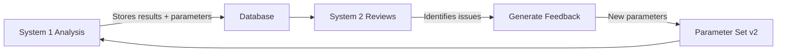

# Parameter Tracking for System 1 - The "Lab Notebook" for ML

## The Immunology Analogy 🔬

Think of this like tracking your flow cytometry experiments:

| Lab Concept | System 1 Equivalent |
|------------|-------------------|
| **Antibody Panel** | ML Models (FinBERT, MiniLM, spaCy) |
| **Antibody Dilution** | Confidence thresholds (0.5 → 0.7) |
| **Gating Strategy** | Entity filters, custom patterns |
| **Compensation Matrix** | Feature weights, ensemble weights |
| **Lot Number** | parameter_set_id (UUID) |
| **Experiment Date** | created_at timestamp |
| **Protocol Version** | parameter_version (v1.1.0) |

## What Gets Tracked

### 1. Every Analysis Links to Its "Recipe"
```sql
-- When we analyze a press release
INSERT INTO system_uno.press_release_sentiment (
    press_release_id,
    sentiment_label,
    positive_score,
    parameter_set_id  -- <-- Links to exact parameters used!
) VALUES (
    1234,
    'positive',
    0.84,
    'a3f4d5e6-7890-bcde-f012-345678901234'  -- The "lot number"
);
```

### 2. The Complete "Recipe" is Stored
```sql
-- Check what parameters were used for any analysis
SELECT 
    s.sentiment_label,
    s.positive_score,
    p.sentiment_model,  -- Which model
    p.confidence_threshold,  -- What threshold
    p.preprocessing_steps,  -- How text was prepared
    p.custom_patterns  -- Any special rules
FROM system_uno.press_release_sentiment s
JOIN system_uno.analysis_parameters p 
    ON s.parameter_set_id = p.parameter_set_id
WHERE s.press_release_id = 1234;
```

## Real-World Example: FDA Approval Detection

### Day 1: Initial Analysis
```python
# Parameter Set v1.0.0
{
    'sentiment_model': 'ProsusAI/finbert',
    'confidence_threshold': 0.5,
    'custom_patterns': []
}
# Result: FDA approval → Neutral (Wrong!)
```

### Day 2: System 2 Provides Feedback
"FDA approvals are being marked neutral, they should be positive"

### Day 3: Create New Parameter Set
```python
# Parameter Set v1.1.0 (with System 2 feedback)
{
    'sentiment_model': 'ProsusAI/finbert',
    'confidence_threshold': 0.7,  # Increased
    'custom_patterns': [
        {'pattern': 'FDA approval', 'boost': 1.5}  # New rule!
    ]
}
# Result: FDA approval → Positive (Correct!)
```

### Day 30: Compare Performance
```sql
-- Which parameter set performed better?
SELECT 
    p.parameter_version,
    p.confidence_threshold,
    COUNT(s.press_release_id) as analyses_count,
    AVG(CASE 
        WHEN pr.content LIKE '%FDA approval%' 
        AND s.sentiment_label = 'positive' 
        THEN 1 ELSE 0 
    END) as fda_detection_accuracy
FROM system_uno.analysis_parameters p
JOIN system_uno.press_release_sentiment s ON p.parameter_set_id = s.parameter_set_id
JOIN press_releases pr ON s.press_release_id = pr.id
GROUP BY p.parameter_version, p.confidence_threshold;

-- Results:
-- v1.0.0 | 0.5 | 100 | 0.20 (20% accuracy on FDA)
-- v1.1.0 | 0.7 | 50  | 0.95 (95% accuracy on FDA!)
```

## A/B Testing (Like Running Controls)

```python
# Create experiment
experiment = parameter_manager.create_experiment(
    name="FDA Keyword Boost Test",
    hypothesis="Adding FDA-specific boosts will improve detection",
    treatment_changes={
        'custom_patterns': [
            {'pattern': 'FDA approval', 'boost': 1.5},
            {'pattern': 'breakthrough designation', 'boost': 1.3}
        ]
    }
)

# Run both versions
for press_release in test_set:
    # 50% get control parameters
    if random() < 0.5:
        analyze_with_parameters(control_parameter_set_id)
    # 50% get treatment parameters
    else:
        analyze_with_parameters(treatment_parameter_set_id)

# Compare results
SELECT 
    CASE 
        WHEN parameter_set_id = 'control-uuid' THEN 'Control'
        ELSE 'Treatment'
    END as group,
    AVG(accuracy) as avg_accuracy,
    COUNT(*) as sample_size
FROM results
GROUP BY parameter_set_id;
```

## System 2 Feedback Loop



## Key Benefits

### 1. **Reproducibility** 
```sql
-- Re-run exact same analysis from 3 months ago
SELECT * FROM system_uno.analysis_parameters 
WHERE parameter_set_id = 'old-uuid';
-- Use these exact parameters to reproduce
```

### 2. **Debugging**
```sql
-- Why did this get marked negative?
SELECT * FROM system_uno.analysis_parameters
WHERE parameter_set_id = (
    SELECT parameter_set_id 
    FROM system_uno.press_release_sentiment 
    WHERE press_release_id = 1234
);
-- Oh, confidence_threshold was 0.9, too strict!
```

### 3. **Learning What Works**
```sql
-- Which parameter sets work best for biotech news?
SELECT 
    p.parameter_version,
    p.custom_patterns,
    AVG(performance_score) as avg_performance
FROM system_uno.analysis_parameters p
JOIN performance_metrics pm ON p.parameter_set_id = pm.parameter_set_id
WHERE pm.domain = 'biotech'
GROUP BY p.parameter_version, p.custom_patterns
ORDER BY avg_performance DESC;
```

## The Power Move

When System 2 says "Your FDA detection sucks", we can:
1. Look at EXACTLY what parameters were used
2. Create a new parameter set with fixes
3. A/B test old vs new
4. Keep what works, discard what doesn't
5. Build a library of domain-specific parameter sets

**It's like building a library of optimized protocols for different sample types!** 🧬

---

## Quick Queries to Try

```sql
-- See all parameter versions
SELECT parameter_version, created_at, change_reason 
FROM system_uno.analysis_parameters 
ORDER BY created_at DESC;

-- Find which parameters work best
SELECT 
    parameter_version,
    validation_metrics->>'accuracy' as accuracy
FROM system_uno.analysis_parameters
ORDER BY accuracy DESC;

-- Track parameter evolution
SELECT 
    from_version.parameter_version as from_v,
    to_version.parameter_version as to_v,
    change_reason
FROM system_uno.parameter_change_log log
JOIN system_uno.analysis_parameters from_version 
    ON log.from_parameter_set_id = from_version.parameter_set_id
JOIN system_uno.analysis_parameters to_version 
    ON log.to_parameter_set_id = to_version.parameter_set_id;
```